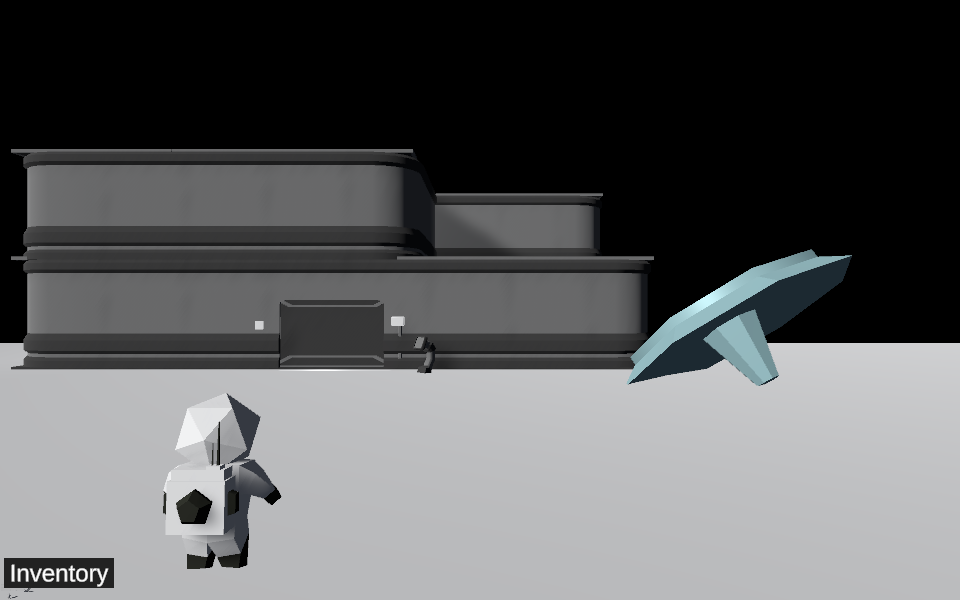
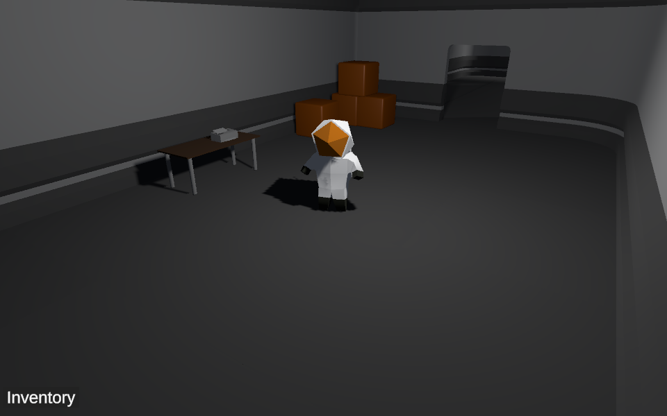

[Play it in-browser on Itch.io](https://float-oat.itch.io/speciare-lunar-research-facility)

# Speciare Lunar Research Facility

A point-and-click adventure about searching for long lost medical cures in an abandoned space laboratory.

Created for [Untitled Game Jam #11](https://itch.io/jam/untitled-game-jam-11).

## Asset credits:

Title screen/intro music by [ArennenBartin](https://www.youtube.com/channel/UCmhzdFbZBPphPs-Pf8pjBzg?app=desktop)

Gameplay music by [slappin salami](https://soundcloud.com/marshymashedamelon)

[Astronaut model](https://assetstore.unity.com/packages/3d/characters/humanoids/stylized-astronaut-114298)

[Environment models](https://assetstore.unity.com/packages/3d/environments/sci-fi/snaps-prototype-sci-fi-industrial-136759)

[Unity WebGL template](https://seansleblanc.itch.io/better-minimal-webgl-template/download/eyJleHBpcmVzIjoxNTc1MTQ0MzQ1LCJpZCI6MTg3NDE2fQ%3d%3d.T%2ffQlD0NYls7Ldt0FE0DmIiF6i0%3d)

## Dev setup
Open the project in Unity. Requires ProBuilder and TextMeshPro.
